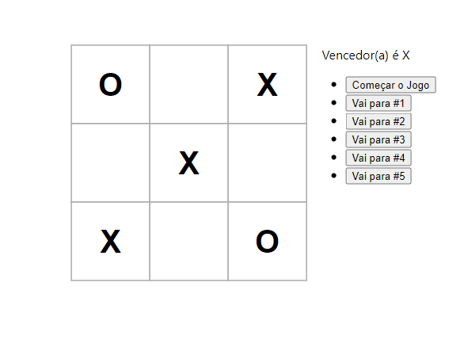

# Jogo da velha

Jogo da velha com React. 
### Web

## 🚀 Iniciando
No diretório do projeto, você pode executar::
### `yarn start`

Executa o aplicativo no modo de desenvolvimento.\
Abra [http://localhost:3000](http://localhost:3000) para visualizá-lo no navegador.

---
Codificado com ❤️  por [Gisele Gois](https://github.com/GiseleGois)